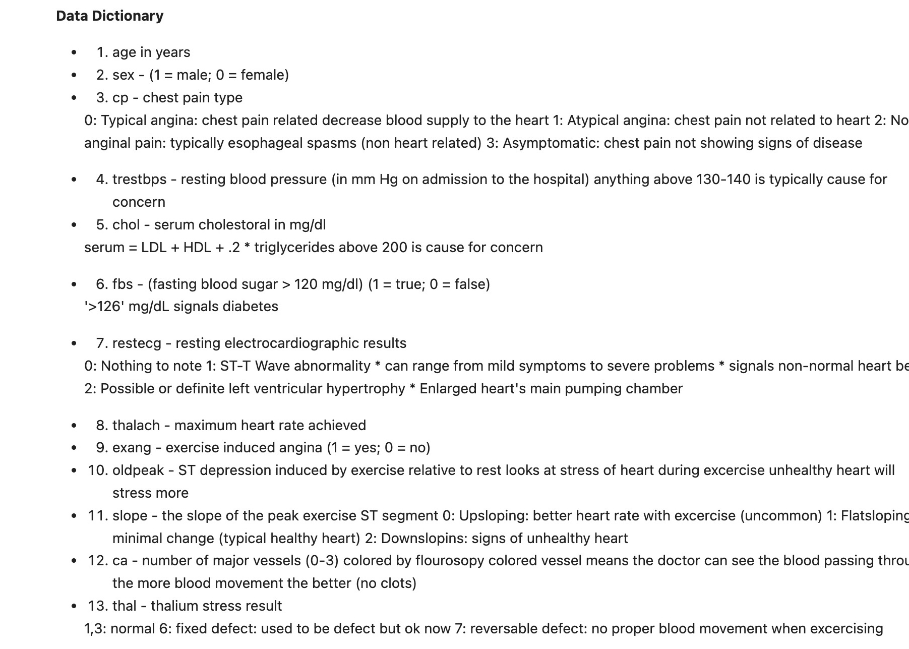
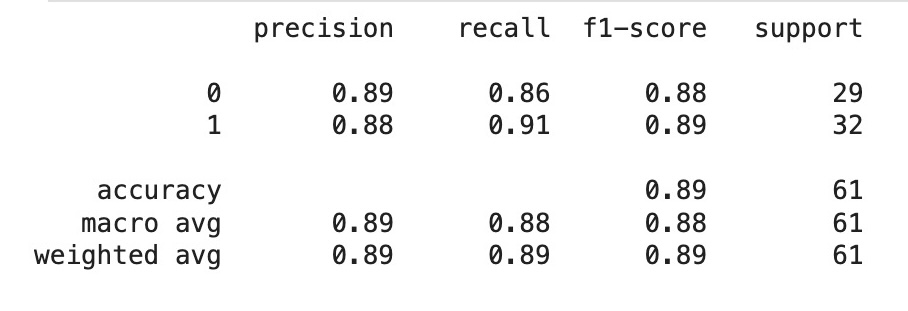

# Heart_Disease_C
A machine learning model capable of predicting whether or not someone has heart disease based on their medical attributes.

Here are some conclusions from this project:

### Features used (Independent Variables)

** Precision is the ratio of correctly predicted positive cases to all predicted positive cases. In this case, for the "Negative" category, the model predicted 29 cases as negative, and 26 of those were actually negative. So, the precision for the "Negative" category is 26/29 = 0.89.

** Recall is the ratio of correctly predicted positive cases to all actual positive cases. In this case, for the "Negative" category, there were 29 actual negative cases, and the model correctly predicted 25 of them. So, the recall for the "Negative" category is 25/29 = 0.86.

** F1-score is a harmonic mean of precision and recall. It takes both precision and recall into account and is a better measure of a model's performance when the classes are imbalanced. In this case, the F1-score for both categories is around 0.88.

See Jupyter Notebook for details of this project: [heart_disease_classification_model_jnbk.ipynb](README.md)
